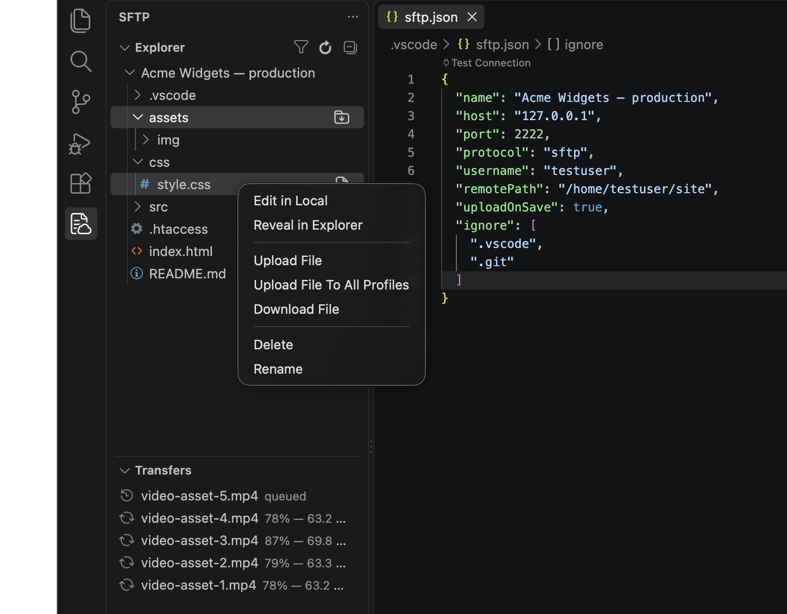

# SFTPresso

[](https://marketplace.visualstudio.com/items?itemName=jmwerk.sftpresso)
[](https://marketplace.visualstudio.com/items?itemName=jmwerk.sftpresso)
[](https://open-vsx.org/extension/jmwerk/sftpresso)
[](https://open-vsx.org/extension/jmwerk/sftpresso)
[](https://github.com/jmwerk/SFTPresso/actions/workflows/ci.yml)
[](LICENSE)

Sync files between a local folder and a remote server over **SFTP (SSH)** or **FTP/FTPS**, right from VS Code. Edit locally in a familiar environment and mirror your changes to a web server, staging box, or embedded device — on every save, on demand, or continuously. The most basic setup is a few lines of config; a wide range of options covers multi-server, profile, and bastion-hop workflows.



- **Install:** [VS Code Marketplace](https://marketplace.visualstudio.com/items?itemName=jmwerk.sftpresso) · [Open VSX](https://open-vsx.org/extension/jmwerk/sftpresso) — see [Installation](#installation)
- **Docs:** [project wiki](https://github.com/jmwerk/SFTPresso/wiki)
- **Repository:** https://github.com/jmwerk/SFTPresso

Actively maintained by [@jmwerk](https://github.com/jmwerk). Forked from [Natizyskunk's vscode-sftp](https://github.com/Natizyskunk/vscode-sftp), which continued [liximomo's original SFTP plugin](https://github.com/liximomo/vscode-sftp) after it went unmaintained. Issues and pull requests welcome.

> **Maintenance status:** As of 2026 this fork is where fixes and updates land. Recent work includes a migration to the `basic-ftp` client, secure password storage, a Transfers view with per-file progress, guided config setup, and a modernized esbuild/TypeScript 5 toolchain — see the [CHANGELOG](CHANGELOG.md) for the full list.

## Features

- Browse remote files in the **Remote Explorer**, with multi-select download/upload
- **Filter the Remote Explorer** (**`SFTP: Filter Remote Explorer`** / **`SFTP: Clear Filter`**) — live substring search across the whole remote tree, including collapsed folders you haven't opened yet. (VS Code's own `workbench.list.keyboardNavigation: filter` setting is a handy complement for searching within a folder you've already expanded.)
- **Diff** a local file against its remote copy, or **Compare Folders** for a recursive diff
- **Sync** in either or both directions, with an optional dry-run preview (`syncConfirm`)
- **Upload/Download** files, folders, or the whole project — optionally to all profiles at once
- **Upload on save** — with a one-click **`SFTP: Toggle Upload on Save`** command and a status-bar indicator — and a **file watcher** for changes made outside the editor
- **Server-side rename and move** — a single remote `rename()` call regardless of size, from the Remote Explorer context menu, by dragging within the Remote Explorer (`remoteExplorer.enableDragAndDrop`), or automatically via `watcher.autoRename`, instead of a full re-upload
- **Add to Ignore** from the file-explorer right-click menu — appends a file or folder to `ignore` without hand-editing `sftp.json`
- **Conflict check** (`conflictCheck`) to catch uploads that would overwrite a remote changed by someone else
- **Transfers view** with byte-level per-file progress, live speed/ETA, cancellation, and retry — cancelling stops the directory scan too, not just the queued files
- **Test Connection** from a command or a CodeLens on `sftp.json`, plus a **connection-status indicator** in the status bar
- **Secure password storage** backed by the OS keychain (`SFTP: Save Password` / `Clear Password`), plus one-click `SFTP: Migrate Plaintext Password` to move a password out of `sftp.json`
- **SSH host key verification** (`strictHostKeyChecking`) — reads your own `~/.ssh/known_hosts` so trusted hosts never prompt, and refuses to connect if a server's key ever changes
- **`SFTP: Run Remote Command`** — run a shell command on the server over the existing SSH connection, no re-authentication; save common ones (`remoteCommands`) as a quick pick
- **Multiple configurations**, switchable **profiles**, SSH **connection hopping**, and temp-file/atomic uploads
- **Legacy-extension conflict detection** — warns on startup if an older `sftp` extension from `@liximomo` or `@Natizyskunk` is also enabled, since both claim the same `sftp.*` commands

See the [command reference](https://github.com/jmwerk/SFTPresso/wiki#3-command-reference) for the full list.

## Installation

As of v1.20.2, each tagged release is published automatically to both the VS Code Marketplace and Open VSX, so you can install from within your editor and get updates automatically.

### From the Marketplace / Open VSX (recommended)

1. Open the Extensions view (`Ctrl+Shift+X` / `Cmd+Shift+X`).
2. Search for **SFTPresso** and install it — or run `ext install jmwerk.sftpresso` from the Command Palette.
3. If you still have an older `sftp` extension installed (from `@liximomo` or `@Natizyskunk`), SFTPresso detects it on startup and prompts you to disable it — both register commands under the same `sftp.*` namespace, so only one can run at a time.

Listings: [VS Code Marketplace](https://marketplace.visualstudio.com/items?itemName=jmwerk.sftpresso) (VS Code, VSCodium, and other VS Code–based editors) · [Open VSX](https://open-vsx.org/extension/jmwerk/sftpresso) (VSCodium, Gitpod, Eclipse Theia, …).

### From a VSIX (manual)

Prefer to sideload a specific build? Grab a `.vsix` from [Releases](https://github.com/jmwerk/SFTPresso/releases) (or build one with `npm run package`), then open the **⋯ (More Actions)** menu at the top of the Extensions view, choose **Install from VSIX…**, select the file, and reload VS Code.

## Quick start

> **Prefer a guided tour?** Run **`Welcome: Open Walkthrough…`** from the Command Palette and pick **Get started with SFTPresso** for a native, checklist-style walkthrough of the steps below.

1. Open the local folder you want to sync (`File → Open Folder…`).
2. Open the Command Palette (`Ctrl+Shift+P` / `Cmd+Shift+P`) and run **`SFTP: Config`**.
3. When no `sftp.json` exists yet, choose how to create it:
   - **Quick setup** — a guided wizard prompts for protocol, host, port, username, authentication, and remote path, then writes `sftp.json` and runs `SFTP: Test Connection` to confirm it works.
   - **Edit JSON** — a starter `sftp.json` opens under `.vscode/`; fill in your server details.

   A minimal config:

   ```jsonc
   {
     "host": "server.example.com",
     "protocol": "sftp",
     "username": "user1",
     "remotePath": "/var/www/project",
     "uploadOnSave": false
   }
   ```

   `password` is optional — leave it out to be prompted on connect (with an offer to remember it in the OS keychain). `sftp.json` is read as JSONC, so comments and trailing commas are allowed.
4. To pull an existing remote project into an empty folder, run **`SFTP: Download Project`**.
5. Edit locally — with `uploadOnSave` on, every save syncs to the remote.

Full setup, all configuration options, usage examples, troubleshooting, and FAQ live in the **[project wiki](https://github.com/jmwerk/SFTPresso/wiki)**:

- [Installation and setup](https://github.com/jmwerk/SFTPresso/wiki#2-installation-and-setup)
- [Command reference](https://github.com/jmwerk/SFTPresso/wiki#3-command-reference)
- [Configuration reference (`sftp.json`)](https://github.com/jmwerk/SFTPresso/wiki#4-configuration-reference-sftpjson)
- [Usage examples and common workflows](https://github.com/jmwerk/SFTPresso/wiki#5-usage-examples-and-common-workflows)
- [Troubleshooting and known issues](https://github.com/jmwerk/SFTPresso/wiki#7-troubleshooting-and-known-issues)
- [FAQ](https://github.com/jmwerk/SFTPresso/wiki#8-frequently-asked-questions)

## Contributing

Development requires Node 22+ (see `.nvmrc`). See [CONTRIBUTING.md](CONTRIBUTING.md) for the build, test, and pull-request workflow.

## Credits

This project builds on the work of [@Natizyskunk](https://github.com/Natizyskunk) and [@liximomo](https://github.com/liximomo). If their earlier work helped you, their original donation links are in the [upstream README](https://github.com/Natizyskunk/vscode-sftp#donation).
